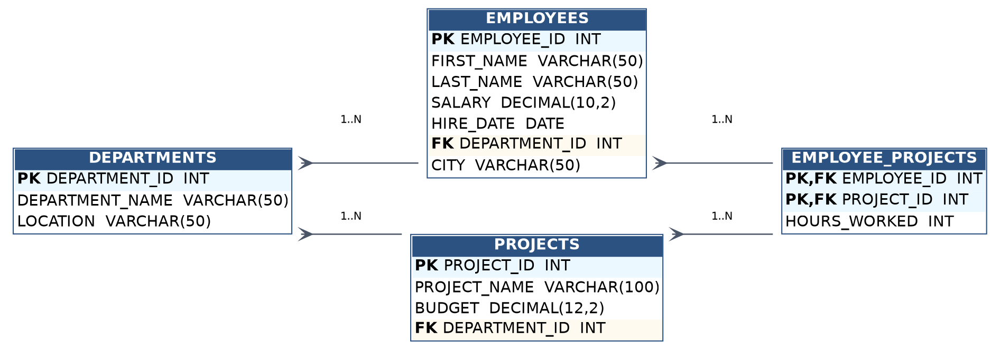

# Organizational SQL Analytics (ESA_SQL_2025)

A normalized 4-table MySQL schema (departments, employees, projects, assignments) with 14 analytical queries covering joins, window functions (`DENSE_RANK`, running totals), CTEs, and views — built to practice production-style analytical SQL patterns.

## 📊 Overview

This project models a simple organizational database with **10 departments**, **50 employees**, **20 projects**, and **100 employee-project assignments**, then uses SQL to surface compensation, tenure, and project-cost insights.

## 🗂️ Schema

| Table | Rows | Description |
|---|---|---|
| `DEPARTMENTS` | 10 | Department name and location |
| `EMPLOYEES` | 50 | Employee details, salary, hire date, department, city |
| `PROJECTS` | 20 | Project name, budget, owning department |
| `EMPLOYEE_PROJECTS` | 100 | Junction table linking employees to projects with hours worked |

### Entity-Relationship Diagram



- One department has many employees and many projects (1:N)
- Employees and projects have a many-to-many relationship, resolved via `EMPLOYEE_PROJECTS`

## 📁 Repository Structure

```
├── SQL_Project.sql              # Full DDL, sample data, and all analysis queries
├── dataset_ER_diagram.png       # ER diagram (image)
├── dataset_ER_diagram.svg       # ER diagram (vector)
└── dataset/
    ├── departments.csv
    ├── employees.csv
    ├── projects.csv
    └── employee_projects.csv
```

## 🔍 Business Questions Answered

1. Total and average salary by department (ranked by total salary)
2. Top 3 longest-tenured employees
3. Employees working on more than one project
4. Project budgets vs. average salary of assigned employees
5. Employees eligible for a bonus (above average salary), ranked
6. Top 3 projects by total salary cost of assigned employees
7. Top 3 highest-paid employees per department (window functions)
8. Cumulative salary total ordered by hire date (running total)
9. Departments with 10+ employees earning above ₹60,000
10. Highest-paid employee in the Marketing department
11. Min / max / average salary per department (5+ employees only)
12. Employees earning above the Finance department's average salary
13. A `HighSalaryEmployees` view showing the top earner per department
14. Employees working on above-average-budget projects

## 🛠️ Tech & Concepts Used

- **Joins:** `INNER JOIN` across employees, departments, projects
- **Aggregations:** `SUM`, `AVG`, `MIN`, `MAX`, `COUNT` with `GROUP BY` / `HAVING`
- **Window functions:** `DENSE_RANK() OVER (PARTITION BY ...)`, running `SUM() OVER (ORDER BY ...)`
- **Subqueries:** correlated and non-correlated
- **CTEs:** `WITH ... AS (...)`
- **Views:** `CREATE VIEW`

## ▶️ How to Run

1. Install MySQL (8.0+ recommended, for window function support).
2. Run the script:
   ```bash
   mysql -u root -p < SQL_Project.sql
   ```
3. This creates the `ESA_SQL_2025` database, tables, sample data, and executes all analysis queries.

## 📌 Notes

- The CSV files in `/dataset` are exports of the sample data for quick exploration in Excel, pandas, or BI tools without needing to run the full SQL script.
- All salary figures are illustrative sample data, not real compensation figures.

---
*Built as a SQL practice project covering joins, window functions, subqueries, and views.*
